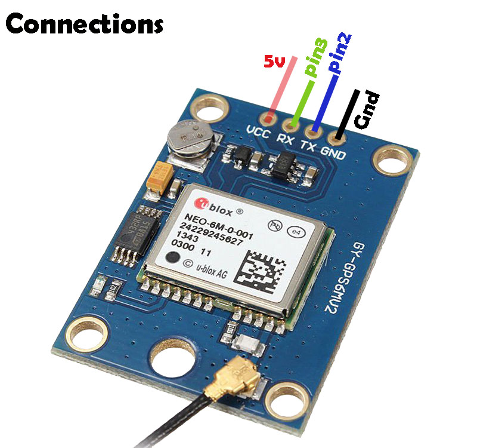
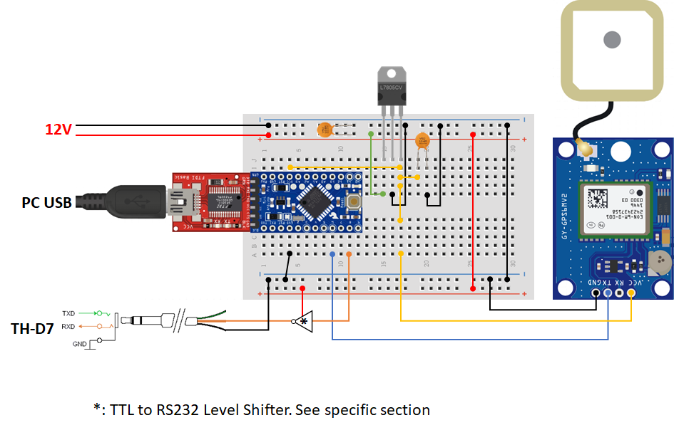
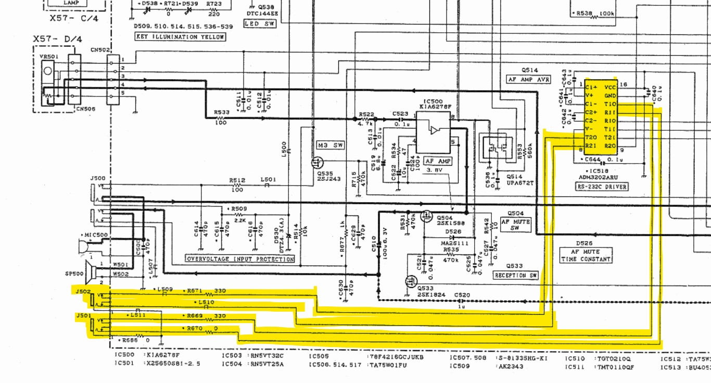

# TH-D7E NMEA CONVERTER: yet another NMEA converter for TH-D7 APRS (but with explanation!)
TH-D7 is a portable VHF/UHF FM transceiver from Kenwood: [link](https://www.kenwood.com/i/products/info/amateur/thd7ae.html).
There are plenty of bargains possible online for this radio (it was first introduced back in 1999 and is now discontinued.
The particuarity of this model is that it embeds a modem (TNC, Terminal Node Controller) and is able to encode and decode [APRS](https://aprs.fi/) packets.

For the latter to work, the transceiver needs to be hooked up to a GPS receiver so that the position information is encoded into the packet to be sent (there is also the possibility to hardcode the position, but I don't see where the fun is...).

I own one since the early 2000s and my idea was to build a battery pack with embedded GPS using a cheap uBlox NEO6m receiver.
The problem is that early THD7s had a problem reading the serial stream since NMEA 0183.3 superseded 0183.2 for the reasons described in the "Potator article", so that any modern GPS won't be decoded by the transceiver.

## Documentation research
First, forget about Kenwood documentation: the guy was put on the market when Garmin was still selling portable trekking GPS, PC still had serial ports and the Spice Girls were still on active duty.
As usual, starting point: Google. I found [this site](https://www.qsl.net/ta1md/projects/nmeacon.htm) where the author speak about the problem and provides a link to another site (the "Potator article") where there is the explanation of why the bug occurrs. Unfortunately the link is broken 😢.
On the site there is also a source code for PIC, but since for this project I'll use an  I have lying around, I'll have to write the code myself.

## Reverse Engineering
On the C source code from TA2AWM i spotted ```printf("$GPRMC,");``` and it turns out that this is the problematic NMEA sentence. To understand what is the root cause I set up a reverse engineering test where I was sending NMEA sentences to the radio using a computer terminal (4800-n-8-1) and a USB to RS323 converter until I was not able to get them correctly interpreted. 

### NMEA sentences used to transfer the position information
```$GPRMC,123519,A,4807.038,N,01131.000,E,022.4,084.4,230394,003.1,W*6A```

Where:

* RMC           Recommended Minimum sentence C
* 123519        Fix taken at 12:35:19 UTC
* A             Status A=active or V=Void.
* 4807.038,N    Latitude 48 deg 07.038' N
* 01131.000,E   Longitude 11 deg 31.000' E
* 022.4         Speed over the ground in knots
* 084.4         Track angle in degrees True
* 230394        Date - 23rd of March 1994
* 003.1,W       Magnetic Variation
* \*6A          The checksum data, always begins with "\*"

For more information on NMEA protocol:
* [https://gpsd.gitlab.io/gpsd/NMEA.html](https://gpsd.gitlab.io/gpsd/NMEA.html)
* [https://en.wikipedia.org/wiki/NMEA_0183](https://en.wikipedia.org/wiki/NMEA_0183)

### Reverse engineering done with PC and terminal connected to the HT, sending manually GPRMC messages
This does not work:  
>from ```$GPRMC,211040.00,A,4340.05768,N,00702.54714,E,0.028,,010820,,*13```  
>to (CRC recalculated) ```$GPRMC,211040,A,4340.057,N,0702.547,E,0.028,,010820,,*06```  

This works:  
>from ```$GPRMC,211040.00,A,4340.05768,N,00702.54714,E,0.028,,010820,,*13```  
>to ```$GPRMC,211040,A,4340.057,N,00702.547,E,00.0,000.0,010820,0.0,E,S*36```  

Rule:  
>Each of the RMC fields must have a fixed length  
>```$GPRMC,211040.00,A,4340.05768,N,00702.54714,E,0.028,     ,010820,   ,   *13```  
>```$GPRMC,211040   ,A,4340.057  ,N,00702.547  ,E,00.0 ,000.0,010820,0.0,E,S*36```

To recalculate the checksum I used this [online NMEA Checksum Calculator](https://nmeachecksum.eqth.net/)

## GPS module description

For this project I used a cheapo uBlox NEO6M GPS module which can be found in many online stores: 


Any general purpose GPS will work provided that it outputs a GPRMS sentence on a UART port.
If yor GPS sends data at different speed, you'll have to modify the corresponding #define on the code:
>```#define GPS_SPEED 9600```

Please Note
1. The module sports a E²PROM memory to store settings after power cycling: I tried to change the bitrate using u-cnter software but for same reason that was not working
2. ⚠️Ensure the compatibility between of logic level between Arduino and GPS. This is a RX-only application so everything is fine as long as VOH_GPS > VIH_ARDUINO and you use a series resistor between the two (1k should be ok to limit the current)

## Connection Schematics
Here's the connection diagram (only essential bypass capacitors are shown)


And Arduino Pro Mini pin-out for reference


## Level shifter

The TH_D7 has an internal Level shifter (Analog Devices ADM3202) which adapts its 3V3 data bus to RS323 for both the GPS and serial control jack interfaces: 



The easy solution to interface to a non-RS232 PC is to use a RS232 converter such as MAX232.

However in case a RX-only solution is needed there is an easier solution involving less components:

TO BE DONE

## Resources:
* https://www.richardmudhar.com/blog/2015/12/gps-serial-receiver-for-kenwood-th-d7/
* https://nmeachecksum.eqth.net/
* https://www.qsl.net/ta1md/projects/nmeacon.htm


